

# :chart_with_upwards_trend:&nbsp; <ins>RAPPORT D'OPTIMISATION</ins>

## <ins>AVANT / APRÈS &nbsp;(**10 RECOMMANDATIONS**)</ins>

Toutes les recommandations ont été implémentées sans toucher aux fichiers ou à l'architecture du site.
Celui-ci pourrait être simplifié en utilisant moins de libraries (sans Bootstrap ni Blocs.js, juste avec CSS grid par exemple). Cela pourra faire l'objet d'un autre audit.
On focalisera ici sur les améliorations du site tel qu'il est, autour de 3 axes:

- :mag_right:&nbsp; **SEO**
- :wheelchair:&nbsp; **Accessibilité**
- :rocket:&nbsp; **Performance**

## <ins>SOMMAIRE DU RAPPORT</ins>

### :mag_right:&nbsp; [<ins>**SEO**</ins>](#SEO)

1.  [Description du site](#1)
2.  [Titre du site](#2)
3.  [Navigation / menu](#3)
4.  [Liens externes (Partie 1)](#4a)

### :wheelchair:&nbsp; [<ins>**ACCESSIBILITÉ**</ins>](#ACCESS)

5. [Langue du site](#5)
6. [Hiérarchisation du _heading_](#6)
7. [Contraste insuffisant](#7)
8. [Images de texte](#8)
9. [Liens externes (Partie 2)](#4b)

### :rocket:&nbsp; [<ins>**PERFORMANCE**<ins>](#PERF)

9. [Format et taille des images](#9)
10. [Chargement et minification des fichiers](#10)

---

### :fire:&nbsp; **<ins>RÉSULTATS DE L'OPTIMISATION PROPOSÉE</ins> :**

| 🔴&nbsp; **LIGHTHOUSE REPORT <ins>AVANT</ins> CORRECTION</ins>** |   ✅&nbsp; **LIGHTHOUSE REPORT <ins>APRÈS</ins> CORRECTION**   |
| :--------------------------------------------------------------: | :------------------------------------------------------------: |
|   | 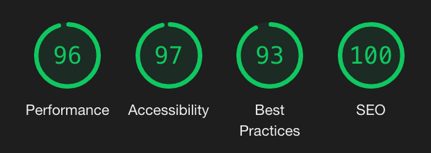 |

[**_<ins>Aller au comparatif complet des résultats à la fin du rapport</ins>._**](#results)

---

---

# RAPPORT D'ANALYSE DANS LE DÉTAIL

---

<h1 align="center">🔍 <ins>SEO</ins></h1>

### 1 - <ins>DESCRIPTION DU SITE</ins>

:poop:&nbsp; **Balise `meta` description vide :**

- le contenu de la description du site est vide! elle ne pourra donc pas être indexée. Très mauvais point SEO.

&nbsp;

:construction:&nbsp; <ins>**CORRECTION**</ins>

- petit texte de description pour l'attribut `content`

&nbsp;

:rocket:&nbsp; <ins>**AMÉLIORATION**</ins>

- on gagne **+10pts score SEO** sur l'audit _Lighthouse_ (de 80% à 90%)

&nbsp;

[ :arrow_up: retour au sommaire](#top-menu)

---

### 2 - <ins>TITRE DU SITE</ins>

:poop:&nbsp; **Balise `title` vide :**

- mettre un `.` dans `title` ne permettra pas d'être trouvé dans les moteurs de recherche.

&nbsp;

:construction:&nbsp; <ins>**CORRECTION**</ins>

- titre fourni (nécessaire pour indexer la page correctement) :

&nbsp;

:rocket:&nbsp; <ins>**AMÉLIORATION**</ins>

- **score SEO à 100%** sur l'audit _Lighthouse_!

&nbsp;

**_NB: <ins>le titre est AUSSI très important pour l'accessibilité</ins>.  
En effet le titre contenu dans `<title>`est nécessaire pour les screen-readers qui le liront à l'utilisateur. Bien renseigner la balise `<title>` améliore donc non seulement le SEO mais aussi l'accessibilité du site.
Suite à la correction, on gagne <ins>+5pts en Accessibilité sur l'audit Lighthouse! (de 81% à 86%)<ins>._**

&nbsp;

[ :arrow_up: retour au sommaire](#top-menu)

---

### 3 - <ins>NAVIGATION / MENU</ins>

:poop:&nbsp; **Navigation / menu peu clair :**

- sur la page d'accueil:

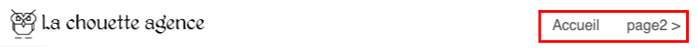&nbsp;

- sur la page contact:

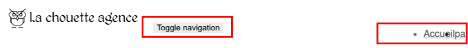&nbsp;

- présence de `
` cachées contenant des mots-clés afin d'améliorer le référencement. :warning: C'est une très mauvaise pratique considérée comme une _technique Blackhat_, pénalisée par Google! Donc aucune chance d'améliorer le référencement de cette façon.

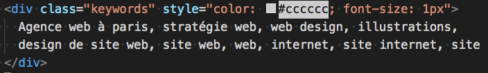&nbsp;

:construction:&nbsp; <ins>**CORRECTIONS**</ins>

- réorganisation et renommage des liens dans la `<navbar>`
- corrections des erreurs (liens css erronés) sur la page2.html
- suppression des `
`
- ajout d'indice visuel lors du survol et focus des liens du menu (:wheelchair:)
- texte `alt` amélioré pour l'image du logo du site (:wheelchair:)&nbsp;

:rocket:&nbsp; <ins>**AMÉLIORATIONS**</ins>

- le menu `<navbar>` est maintenant beaucoup plus clair/explicite (pour améliorer le <ins>SEO</ins>) et aussi plus facilement compréhensible pour les utilisateurs (<ins>accessibilité</ins> améliorée).

**_NB: en corrigeant les erreurs sur la page contact (page2.html), la mise en page de toute la page à été débuggée pour obtenir le layout voulu au départ. J'en ai profité pour améliorer l'accessibilité du formulaire de contact en ajoutant des attributs `for` pour les labels_**

| <ins>AVANT</ins>                               | <ins>APRÈS</ins>                              |
| ---------------------------------------------- | --------------------------------------------- |
| 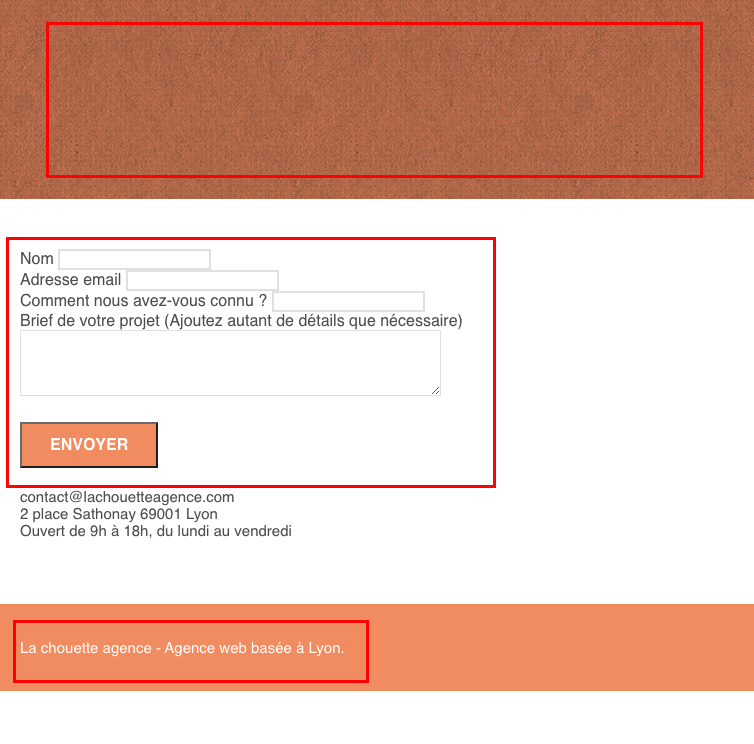 | 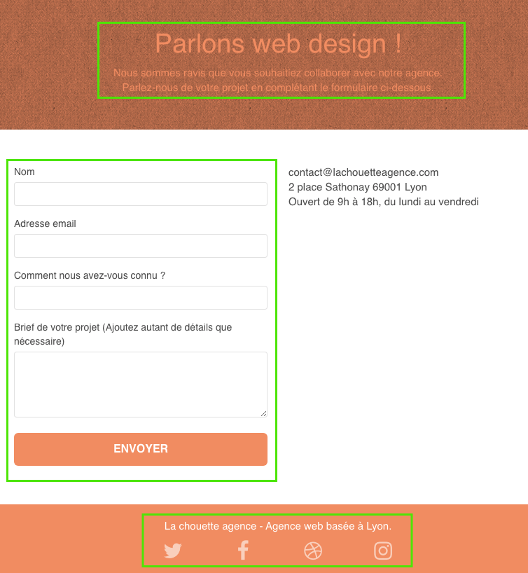 |

&nbsp;
[ :arrow_up: retour au sommaire](#top-menu)

---

### <ins>LIENS EXTERNES (PARTIE 1: SEO)</ins>

:poop:&nbsp; **Les liens externes sont inaccessibles et ne respectent pas les bonnes pratiques.**

- les url des liens externes ne contiennent pas de protocole `http`, ils sont donc inaccessibles pour les visiteurs du site:

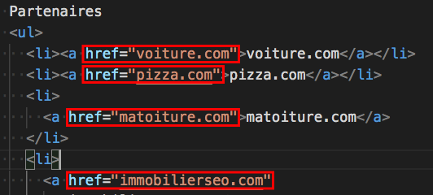&nbsp;

- les annuaires de liens dans le footer sont une très mauvaise pratique SEO: ils n'ont rien à voir avec le site et sont considérés comme un _système de liens_ :warning: et enfreignent les consignes de Google.

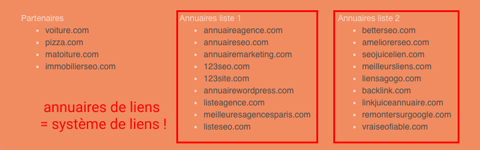&nbsp;

:construction:&nbsp; <ins>**CORRECTIONS**</ins>

- ajout du protocole `http` dans les liens partenaires (footer)
- suppression des annuaires de liens contenus dans le footer

<!-- 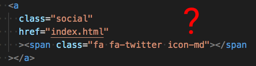  -->

:rocket:&nbsp; <ins>**AMÉLIORATIONS**</ins>

- le site est maintenant conforme aux consignes de Google relatives aux systèmes de liens: on ne risque plus de pénalité SEO.
  &nbsp;

[ :arrow_up: retour au sommaire](#top-menu)

---

<h1 align="center">♿ <ins>ACCESSIBILITÉ</ins></h1>

### 5 - <ins>LANGUE DU SITE</ins>

:poop:&nbsp; **Attribut `lang` incorrect.**

- l'attribut `lang` est défini sur "Default", valeur qui n'existe pas. Il faut choisir le language adapté au site, ici le français.

&nbsp;

:construction:&nbsp; <ins>**CORRECTION**</ins>

- modification de l'attribut `lang` avec une valeur valide (nécessaire pour les screen-reader) :

&nbsp;

:rocket:&nbsp; <ins>**AMÉLIORATION**</ins>

- on gagne **+5pts d'Accessibilité** sur l'audit _Lighthouse_ (de 76% à 81%)

&nbsp;

[ :arrow_up: retour au sommaire](#top-menu)

---

### 6 - <ins>HIÉRARCHISATION DES TITRES DANS LA PAGE</ins>

:poop:&nbsp; **Non-respect de la hiérarchisation du _heading_ :**

- ne pas utiliser de `<h3>` en l'absence de `<h2>` dans le même bloc.  
  Cela nuit à l'accessibilité du site car crée une confusion pour les screen-readers et donc pour leurs utilisateurs.

&nbsp;

:construction:&nbsp; <ins>**CORRECTIONS**</ins>

- les `<h3>` sont remplacés par des `<h2>` là où nécessaire
- la structure du bloc "Nos réalisations" a été revue et simplifiée/corrigée pour pouvoir utiliser les `<h3>` sous un `<h2>` .

&nbsp;

:rocket:&nbsp; <ins>**AMÉLIORATION**</ins>

- on gagne **+4pts d'Accessibilité** sur l'audit _Lighthouse_ (de 86% à 90%)

 &nbsp;

**_NB 1: La hiérarchisation du heading a très longtemps été un des points les plus importants pour un bon référencement, mais ce n'est plus vraiment le cas aujourd'hui. C'est davantage une question d'accessibilité que de référencement pur et dur._**  
 **[Sur ce sujet : réponses très intéressantes de John Mueller, expert SEO chez Google. ](https://www.searchenginejournal.com/heading-tags-for-seo/341817)**

**_NB 2: Pour aller plus loin et dans le sens d'une bonne hiérarchisation / structuration du code html de la page, il serait bon de simplifier le code et d'utiliser certaines balises sémantiques comme `header`, `main`, `section`, `footer`etc... Mais le sujet ne sera pas approfondi dans ce rapport, on focalise ici sur les 10 points les plus importants._**

[ :arrow_up: retour au sommaire](#top-menu)

---

### 7 - <ins>CONTRASTE INSUFFISANT</ins>

:poop:&nbsp; **Certains éléments sont difficiles à lire car pas assez de contraste :**

- les textes placés sur des background image ou texturés sont difficiles à lire, ce qui nuit à l'accessibilité du site.

  <ins>_Résultats de l'audit WAVE sur les éléments principaux</ins>_:

  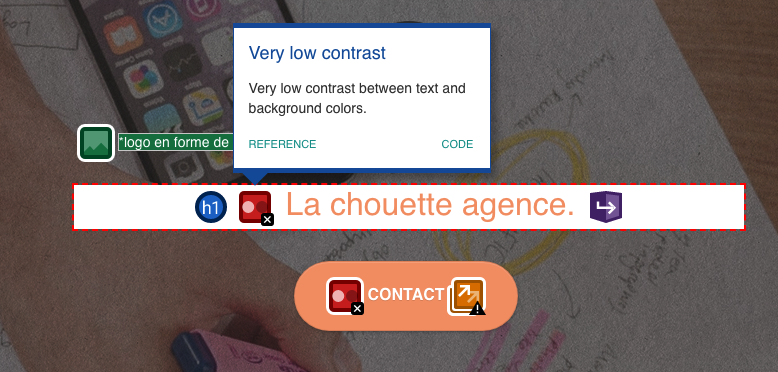
  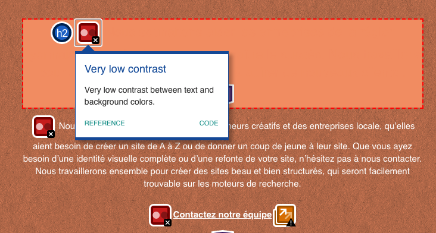
  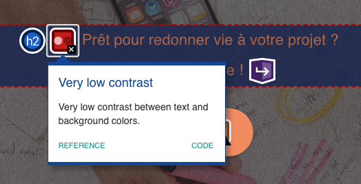
  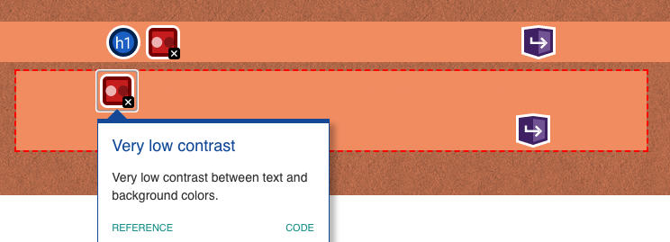

&nbsp;
:construction:&nbsp; <ins>**CORRECTION**</ins>

- création d'une classe `.bg-accessibility` afin d'ajouter un background rgba plus sombre aux éléments concernés :

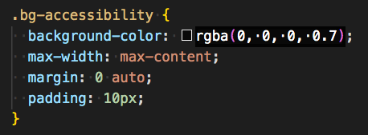&nbsp;

:rocket:&nbsp; <ins>**AMÉLIORATION**</ins>

- les textes ressortent beaucoup mieux, lisibles sans effort et on passe les audits _Wave_ et _WCAG Accessibility Audit_:

 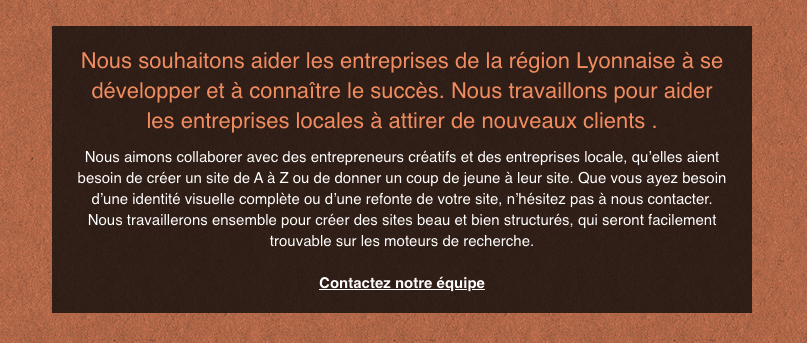 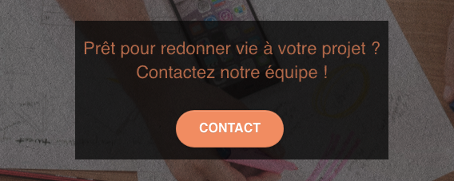 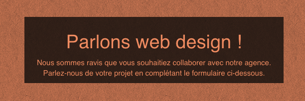

**_NB 1: à l'occasion de cette correction, le background du bloc-4 (lignes horizontales) a été remplacé par un fond blanc simple. Cela augmente aussi la lisibilité des textes._**

| <ins>AVANT</ins>                                              | <ins>APR&Egrave;S</ins>                                      |
| ------------------------------------------------------------- | ------------------------------------------------------------ |
|  |  |

**_NB 2: à l'occasion de cette correction, la taille de la police inférieure à 12px a été remplacée par 15px, pour plus de lisibilité aussi._**

 

| <ins>AVANT</ins>                           | <ins>APRÈS</ins>                          |
| ------------------------------------------ | ----------------------------------------- |
|  |  |

[ :arrow_up: retour au sommaire](#top-menu)

---

### 8 - <ins>IMAGES DE TEXTE</ins>

:poop:&nbsp; **Utilisation d'images pour afficher du texte :**

- certains textes sont sous forme d'image (ne peuvent être lus par les screenreader + impossible à crawler/indexer).

&nbsp;
&nbsp;

:construction:&nbsp; <ins>**CORRECTION**</ins>

- remplacement des images par du texte sous forme de `<h2>`, `
` ou `` selon les situations:

&nbsp;

:rocket:&nbsp; <ins>**AMÉLIORATIONS**</ins>

- tous les textes affichés sur le site peuvent être lus par les screenreaders + crawlés et indexés par Googlebot.

&nbsp;

[ :arrow_up: retour au sommaire](#top-menu)

---

### <ins>LIENS EXTERNES (PARTIE 2: ACCESSIBILITÉ)</ins>

:poop:&nbsp; **Certains liens externes ne respectent pas les bonnes pratiques.**

- les liens vers les réseaux sociaux ne respectent pas les bonnes pratiques d'accessibilité car ils ne contiennent aucun texte et devraient donc avoir un attribut `aria-label` pour annoncer le lien aux utlisateurs de screen-readers ou autres technologies d'assistance.

 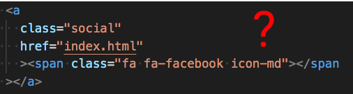 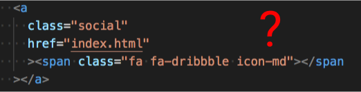 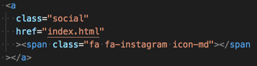&nbsp;

:construction:&nbsp; <ins>**CORRECTION**</ins>

- ajout d'un attribut `aria-label` pour les liens vers les réseaux sociaux

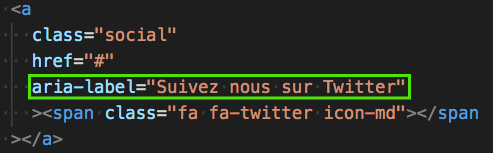 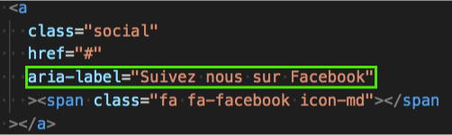 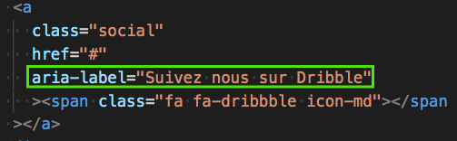 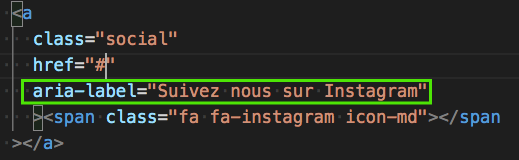&nbsp;

:rocket:&nbsp; <ins>**AMÉLIORATION**</ins>

- **gros point fort pour l'accessibilité**: on gagne **+7pts sur l'audit _Lighthouse_**! (de 90% à 97%)

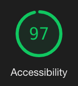&nbsp;

[ :arrow_up: retour au sommaire](#top-menu)

---

<h1 align="center"> 🚀 <ins>PERFORMANCE</ins></h1>

### 9 - <ins>FORMAT ET TAILLE DES IMAGES</ins>

:poop:&nbsp; **Taille et format incorrects pour les images :**

- les images utilisées ne sont pas à la bonne taille ou au au bon format pour le web. Soit trop grandes comparées à leur conteneur/CSS, soit au format `.bmp` (ou `.jpeg` pour le favicon), formats non optimaux pour le web.

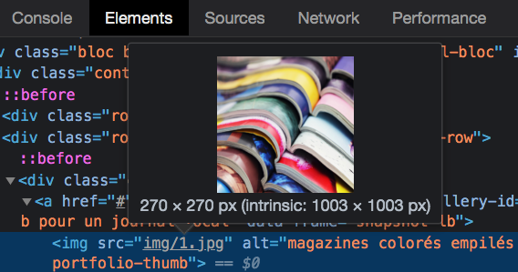&nbsp;&nbsp;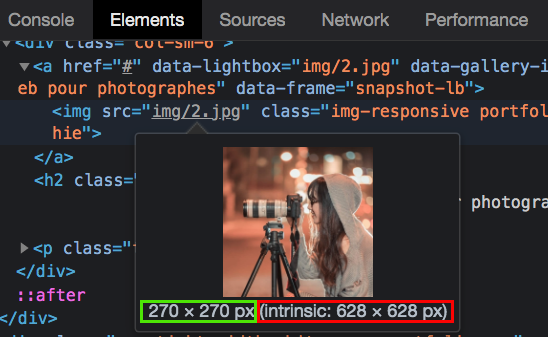&nbsp;

:construction:&nbsp; <ins>**CORRECTIONS**</ins>

- images redimensionnées à taille de leur conteneur (270px)
- attributs `width` et `height` stipulés dans le html
- formats `.bmp` et `jpeg` remplacés par `.png` (favicon et images de la section portfolio)
- bannière convertie au format WebP&nbsp;

:rocket:&nbsp; <ins>**AMÉLIORATIONS**</ins>

- on gagne en **taille (-0.4MB)** et en **rapidité(-0.5s)** d'affichage, d'après l'outil _Network_ des DevTools (Chrome):

<ins>AVANT / APR&Egrave;S</ins> :

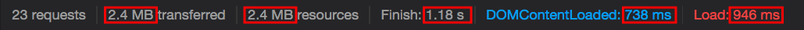

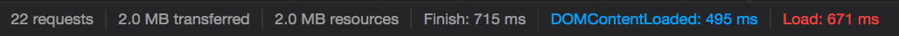&nbsp;

<ins>Audit Lighthouse</ins> : on gagne **+3pts en _Performance_** (de 89% à 92%) et **+6pts en _Best Practices_** (de 87% à 93%)

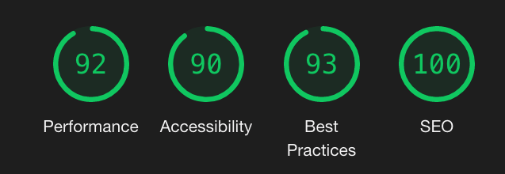&nbsp;

**_NB 1: suite à cette correction, <ins>disparition de l'erreur loggée dans la console</ins> au lancement du site (`erreur 404` pour l'image du banner)._**

**_NB 2: à l'occasion de cette correction, certains détails liés à la <ins>responsivité du site</ins> ont aussi été corrigés :_**
_- images de la section portfolio centrées sur l'écran (au lieu d'être alignées à gauche)_
_- div "social" du footer qui contient les icônes réseaux sociaux : `display = flex` au lieu de `block` (colonne)_

| <ins>AVANT</ins>                                                    | <ins>APR&Egrave;S</ins>                                            |
| ------------------------------------------------------------------- | ------------------------------------------------------------------ |
| 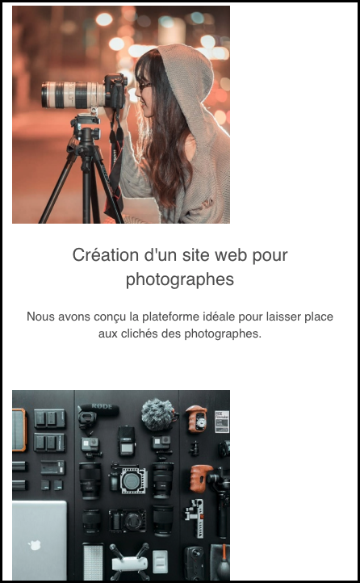 | 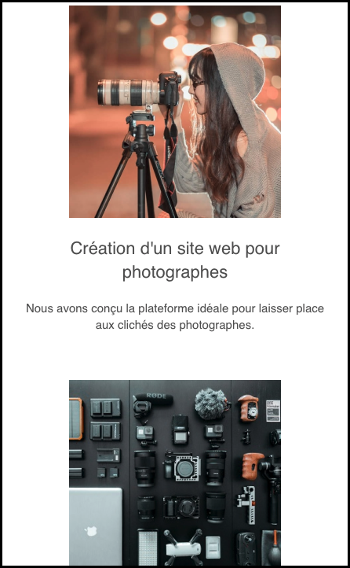 |
| 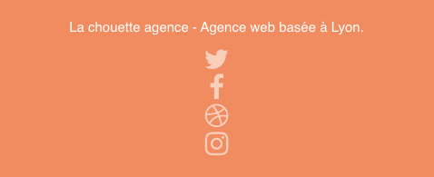          | 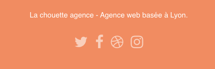          |

[ :arrow_up: retour au sommaire](#top-menu)

---

### 10 - <ins>CHARGEMENT ET MINIFICATION DES FICHIERS</ins>

:poop:&nbsp; **Scripts bloquants et fichiers non minifiés.**

- les scripts JS bloquent le html parsing et les fichiers JS et CSS ne sont pas minifiés.&nbsp;

:construction:&nbsp; <ins>**CORRECTIONS**</ins>

- ajout de l'attribut `defer` pour les scripts de librairies afin qu'ils ne bloquent pas le parsing du html
- minification des fichiers CSS et JS avec l'extension _Minifier_ de Vscode
- préchargement des polices&nbsp;

:rocket:&nbsp; <ins>**AMÉLIORATIONS**</ins>

- on gagne au minimum **+4pts en Performance** sur l'audit _Lighthouse_ (de 92% à 96%):

&nbsp;

- **on économise 25%** en poids total des ressources du site d'après l'outil _Network_ de DevTools (de 2MB à 1.5MB):

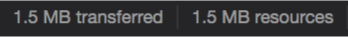&nbsp;

[ :arrow_up: retour au sommaire](#top-menu)

---

 <h2 align="center"> 🔥 <ins>COMPARATIF COMPLET DES RÉSULTATS</ins> </h2>

| 🔴&nbsp; **LIGHTHOUSE REPORT <ins>AVANT</ins> CORRECTION</ins>** |   ✅ &nbsp; **LIGHTHOUSE REPORT <ins>APRÈS</ins> CORRECTION**    |
| :--------------------------------------------------------------: | :--------------------------------------------------------------: |
|   |    |
|                                                                  |                                                                  |
| 🔴&nbsp; **NETWORK (TAILLE) <ins>AVANT</ins> CORRECTION</ins>**  | ✅ &nbsp; **NETWORK (TAILLE) <ins>APRÈS</ins> CORRECTION</ins>** |
|  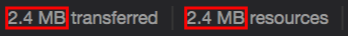  |  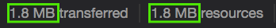   |
|                                                                  |                                                                  |
|  🔴&nbsp; **NETWORK (TEMPS) <ins>AVANT</ins> CORRECTION</ins>**  | ✅ &nbsp; **NETWORK (TEMPS) <ins>APRÈS</ins> CORRECTION</ins>**  |
|    |  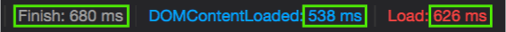   |

|<ins>AMÉLIORATIONS VÉRIFIÉES SUR D'AUTRES OUTILS DE MESURE</ins>|
:--:
|**PageSpeed Insights (Google)**|
|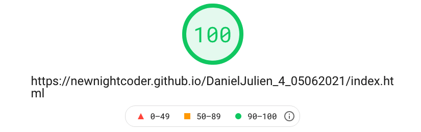|
|**GT METRIX**|
|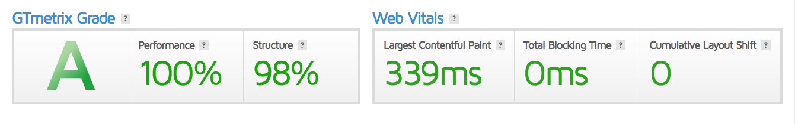|
|**Uptrends**|
|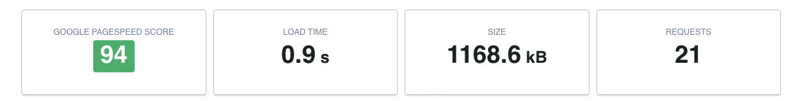|

[ :arrow_up: retour au sommaire](#top-menu)

---

<h2 align="center"> ✔️ <ins>VALIDATION W3C</ins></h2>

**Validation W3C HTML :**

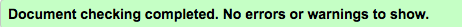&nbsp;

**Validation W3C CSS :**

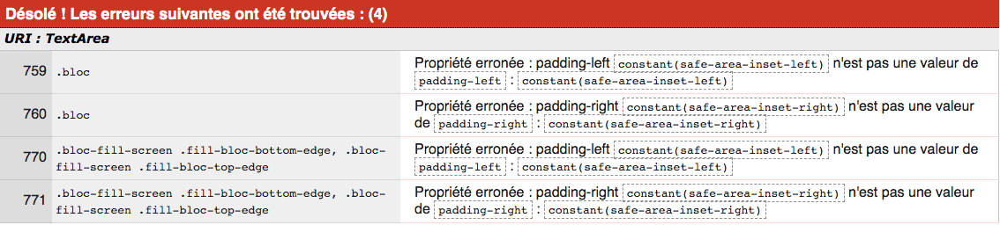

Ces 4 "erreurs" n'en sont pas, ils s'agit des variables CSS env() utilisées par Bootstrap.css.  
Une _issue_ a d'ailleurs été ouverte sur Github à ce sujet (lien vers cette _issue_ sur github [ici](https://github.com/w3c/css-validator/issues/111)).

---

ERRORS REPORT IS [HERE](ERRORS.md).  
BACK TO [README](../README.md).

[ :arrow_up: back to top](#top)
