# :chart_with_upwards_trend:&nbsp; <ins>RAPPORT D'OPTIMISATION</ins>

## AVANT / APRÈS &nbsp;(**10 RECOMMANDATIONS**)

### :mag_right:&nbsp; <ins>**SEO**</ins>

- [x] Balise `meta` "description" à renseigner
- [x] Fournir un titre optimal à la balise `<title>`
- [ ] menu / barre de navigation :
  - [ ] pas assez clair : lien vers page2 mal nommé
  - [ ] problème de dimensions de la navbar sur la page2
  - [ ] `<button>`"toggle navigation" inutile / pas clair
  - [ ] les `
` sont totalement inutiles (mauvaise pratique)

### :wheelchair:&nbsp; <ins>**ACCESSIBILITÉ**</ins>

- [x] Renseigner un language pour l'attribut `lang`
- [x] Fourir un titre à la balise `<title>`
- [x] Respecter la hiérarchisation du _heading_ (pas de `<h3>`au lieu de `<h2>` etc..)
- [x] font-size trop petite
- [x] images-texte un peu partout dans le document

### :rocket:&nbsp; <ins>**PERFORMANCE**</ins>

- [ ] scripts à charger en `defer`ou `async`
- [ ] format et taille incorrects des images

### 🔴&nbsp; **LIGHTHOUSE REPORT AVANT CORRECTION**

---

<h1 align="center">🔍 <ins>SEO</ins></h1>

### 1 - <ins>DESCRIPTION DU SITE</ins>

:poop:&nbsp; **Balise `meta` description vide :**

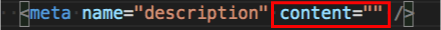&nbsp;

:construction:&nbsp; <ins>**Correction**</ins> : petit texte de description pour l'attribut `content`

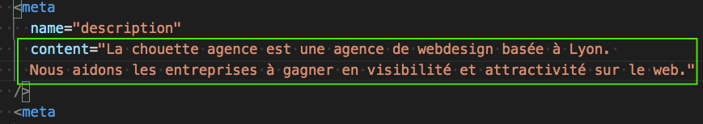&nbsp;

:rocket:&nbsp; <ins>**Amélioration**</ins> : +10pts score SEO (de 80% à 90%)

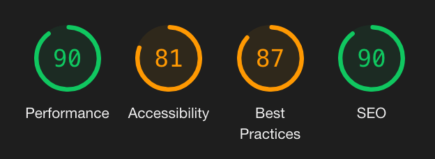

---

### 2 - <ins>TITRE DU SITE</ins> (SEO)

:poop:&nbsp; **Balise `title` vide :**

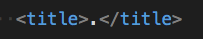 _NB : mettre un `.` dans `title` ne permettra pas d'être trouvé dans les moteurs de recherche_

:construction:&nbsp; <ins>**Correction**</ins> : titre fourni (nécessaire pour indexer la page correctement) :

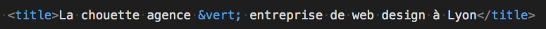&nbsp;

:rocket:&nbsp; <ins>**Amélioration**</ins> : score SEO à 100% sur l'audit Lighthouse!

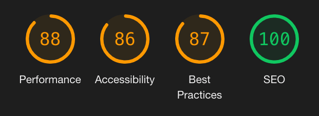

**_NB : <ins>le titre est aussi très important pour l'accessibilité</ins>.  
En effet le titre contenu dans `<title>`est nécessaire pour les screen-reader qui le liront à l'utilisateur. Bien renseigner la balise `<title>` améliore donc non seulement le SEO mais aussi l'accessibilité du site.
Suite à la correction, on gagne +5pts en Accessibilité! (de 81% à 86%)._**

---

<h1 align="center">♿ <ins>ACCESSIBILITÉ</ins></h1>

### 3 - <ins>LANGUE DU SITE</ins>

:poop:&nbsp; **Attribut `lang` incorrect :**

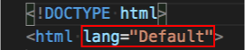&nbsp;

:construction:&nbsp; <ins>**Correction**</ins> : modification de l'attribut `lang` avec une valeur valide (nécessaire pour les screen-reader) :

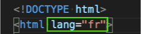&nbsp;

:rocket:&nbsp; <ins>**Amélioration**</ins> : +5pts Accessibility (de 76% à 81%)

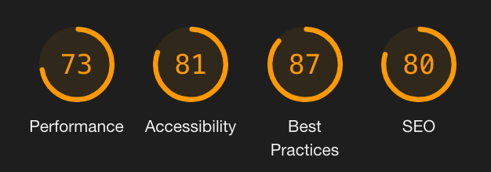

---

### 4 - <ins>HIÉRARCHISATION DES TITRES DANS LA PAGE</ins>

:poop:&nbsp; **Respect de la hiérarchisation du _heading_ :** ne pas utiliser de `<h3>` en l'absence de `<h2>` dans le même bloc.

&nbsp;

:construction:&nbsp; <ins>**Correction**</ins> : tous les `<h3>` sont remplacés par des `<h2>` :

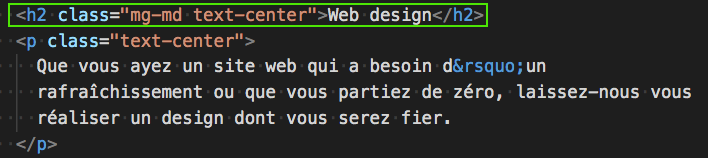&nbsp;

:rocket:&nbsp; <ins>**Amélioration**</ins> : +4pts Accessibility (de 86% à 90%)

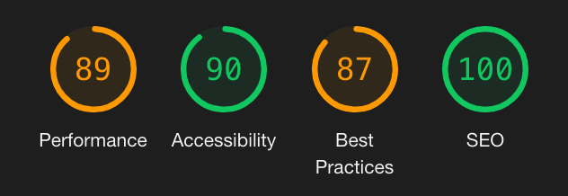

---

### 5 - <ins>TAILLE DE LA POLICE</ins>

:poop:&nbsp; **Taille de police des paragraphes trop petite:** les textes sont difficiles à lire.

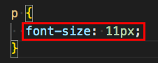&nbsp;
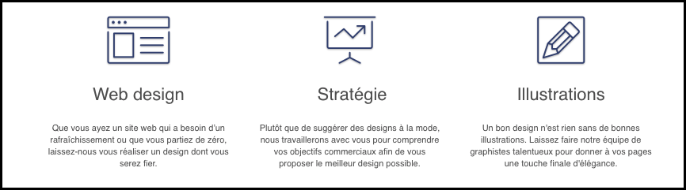&nbsp;

:construction:&nbsp; <ins>**Correction**</ins> : augmenter la taille de la police (entre 14px et 16px):

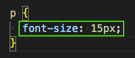&nbsp;

:rocket:&nbsp; <ins>**Amélioration**</ins> : les paragraphes sont lisibles correctement, sans effort.

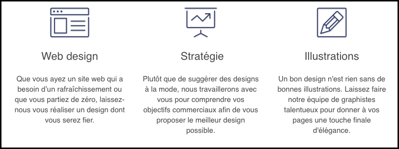

---

### 6 - <ins>TEXTES</ins>

:poop:&nbsp; **Utilisation d'images pour afficher du texte:** certains textes sont sous forme d'image (ne peuvent être lus par les screenreader + impossible à crawler/indexer).

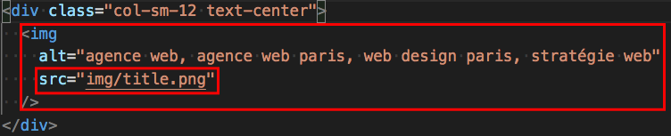&nbsp;
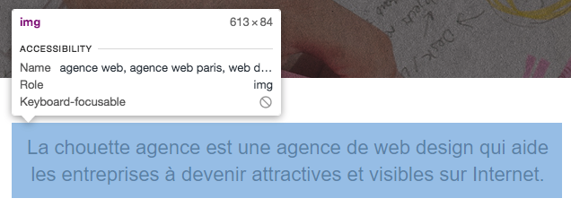&nbsp;

:construction:&nbsp; <ins>**Correction**</ins> : remplacement des images par du texte sous forme de `<h2>`, `
` ou `` selon les situations:

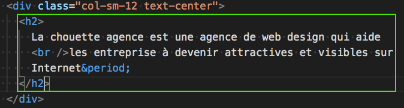&nbsp;

:rocket:&nbsp; <ins>**Amélioration**</ins> : tous les textes affichés sur le site peuvent être lus par les screenreaders + crawlés et indexés par Googlebot.

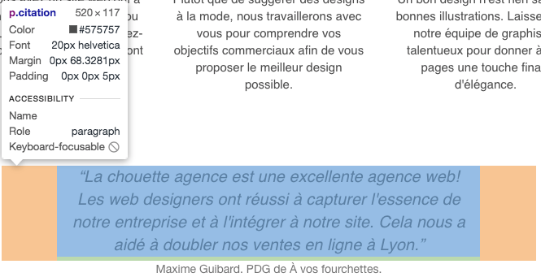&nbsp;

_NB : à l'occasion de cette correction, le background du bloc-4 (lignes horizontales) a été remplacé par un fond blanc simple. Cela augmente la lisibilité des textes._

AVANT  APR&Egrave;S 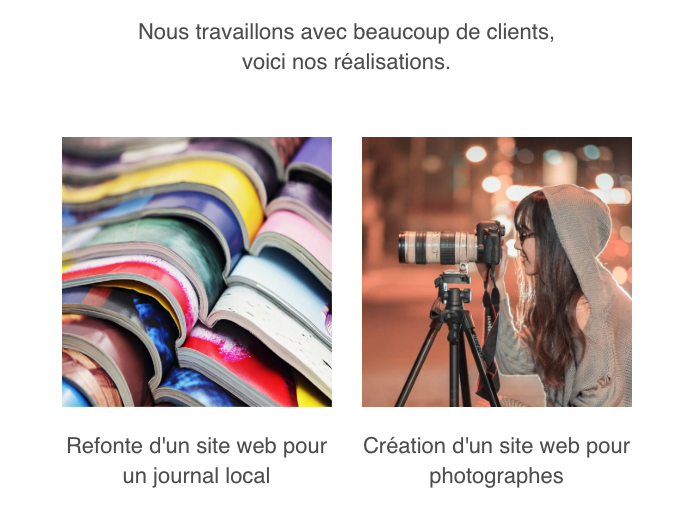&nbsp;

---

<h1 align="center"> 🚀 <ins>PERFORMANCE</ins></h1>

---

Errors report is available [here](ERRORS.md).  
Go back to [README](../README.md).
